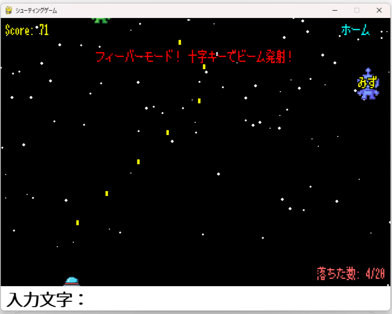

# シューティングタイピングゲーム

## 概要
このゲームは、ひらがな2~3文字の敵をタイピングで撃破していくシューティングゲームです。  
スコアが50点を超えると10秒間のフィーバーモードに突入し、操作が変わります。  
20体敵を逃すとゲームオーバーになります。  

プレイヤーはタイピングの速さと正確さを競いながら楽しめます。

## 動作環境
- Python 3.8以上
- pygame 2.0以上

## インストールとセットアップ

1. リポジトリをクローン  
```bash
git clone https://github.com/Misa117/shooting_game.git
cd shooting_game

遊び方

起動後に名前を入力し、Enter または Space キーで決定します。


ルール説明画面が表示され、Space キーでゲーム開始。

画面に表示されるひらがな3文字を正確にタイプして敵を撃破。


スコア50点以上で10秒間のフィーバーモードに突入し、自動ビーム攻撃が可能。


20体敵を逃すとゲームオーバー。

ゲーム終了後にスコアとランキングが表示されます。


ファイル構成
main.py : ゲームのエントリーポイント

game.py : ゲームのメインロジック

player.py : プレイヤークラス

bullet.py : 弾の処理

enemy.py : 敵キャラクター処理

explosion.py : 爆発アニメーション

romaji_map.py : ひらがなとローマ字対応マップ

scores.json : スコア保存用ファイル（実行後自動生成）

assets/ : 画像やフォントなどのリソース


ライセンス
MIT License

作者
Misa117
GitHub: https://github.com/Misa117

